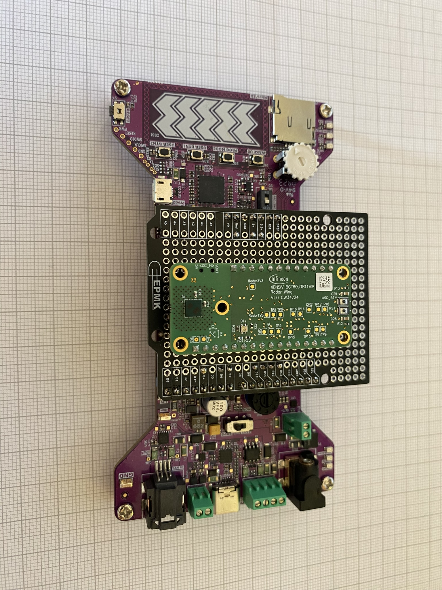
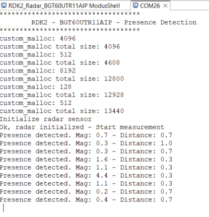

# RDK2 and BGT60UTR11AIP 

This code example demonstrates digital signal processing implemented on a PSoC62 for use with a BGT60UTR11AIP radar sensor from Infineon.

## Requirements

- [ModusToolbox® software](https://www.infineon.com/cms/en/design-support/tools/sdk/modustoolbox-software/) **v2025.4.0** [built with **v3.1**]
- BGT60UTR11AIP wing board from Infineon
- [RDK2](https://www.rutronik24.fr/produit/rutronik/rdk2/16440182.html)

## Supported toolchains (make variable 'TOOLCHAIN')

- GNU Arm&reg; Embedded Compiler v11.3.1 (`GCC_ARM`) - Default value of `TOOLCHAIN`

## Using the code example with a ModusToolbox™ IDE:

The example can be directly imported inside Modus Toolbox by doing:
1) File -> New -> Modus Toolbox Application
2) PSoC 6 BSPs -> RDK2
3) Sensing -> RDK2 BGT60UTR11AIP

A new project will be created inside your workspace.

## Hardware - Connections

| Signal | Infineon Wing Board | RDK2 |
| --- | --- | --- |
|SPI CSN | J2.10 | P1.3 |
|SPI MOSI | J2.12 | P1.4 |
|SPI MISO | J2.13 | P1.5 |
|SPI CLK | J2.11 | P1.6 |
| IRQ | J1.7 | P5.5 |
| RST | J1.6 | P5.7 |
| EN LDO | J1.10 | P5.8 |
|5V | J1.3 | P3.5 |
|3.3V | J2.2 | P3.4 |
|GND | J2.4 | P3.7 |

## Operation

Plug a USB cable into the Kit Prog3 USB connector and open a serial Terminal (you can use the one integrated inside Eclipse IDE for ModusToolbox).

You should see something like this:

## Change the radar configuration
You can change the radar configuration used to measure by generating a new "radar_settings.h" configuration.

Use the Infineon “Radar Fusion GUI” tool to generate a new version of the file.

## Libraries

The project contains a local copy of the sensor-xensiv-bgt60trxx.
Modifications have been made inside the file xensiv_bgt60trxx_mtb.c to detect timeout during SPI transfers.

Remark: the project uses 8 bits SPI transfer (instead of 12 bits) to make it easier for the integration with other micro controllers (which do not support 12 bits transfer).

## Legal Disclaimer

The evaluation board including the software is for testing purposes only and, because it has limited functions and limited resilience, is not suitable for permanent use under real conditions. If the evaluation board is nevertheless used under real conditions, this is done at one’s responsibility; any liability of Rutronik is insofar excluded. 

